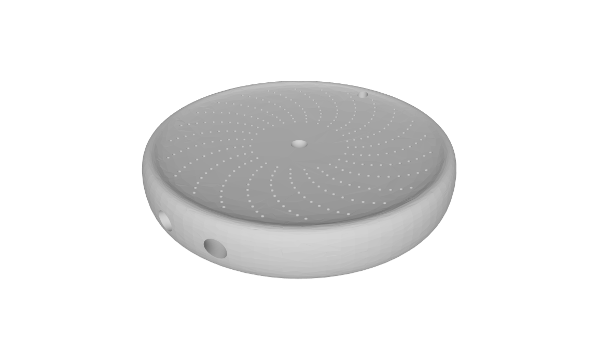

# Nothaus24x24

**Nothaus24x24** is the largest variant of the OpenSeed project.  

It is designed for **maximum redundancy and capacity**, making it ideal if we are looking for redundancy for 24-word passphrases.  
The design encodes words in [**binary**](../../docs/Bip39-Binary.pdf) using a spring-loaded center punch.

---

## 🔧 Specifications

- **Shape:** Circular
- **Diameter:** 50 mm
- **Capacity:** 48 seed words (24 per side)
- **Bits per row:** 12 (enough to represent all 2048 words in the BIP39 list)
- **Lines per side:** 24 curved rows
- **Markings:**
  - Central engraved mark on one side to indicate "Side A"
  - Shallow central hole for orientation (starting point)
- **Surface:** Slightly concave to reduce abrasion and protect against wear

---

## 📂 Files & Preview

- [⬇️ Download STL](https://raw.githubusercontent.com/OpenSeed-org/OpenSeed/main/designs/nothaus24x24/nothaus24x24-v1.stl)  
- [👀 View in 3D (ViewSTL)](https://www.viewstl.com/?url=https://raw.githubusercontent.com/OpenSeed-org/OpenSeed/main/designs/nothaus24x24/nothaus24x24-v1.stl)
- [BIP39 Binary (PDF)](../../docs/Bip39-Binary.pdf)

---

## 📐 Options for use with a 24-word seedphrase

- Engrave the **same 24-word seed twice** (once per side) for redundancy.  
- Alternatively, engrave **two different 24-word seeds**, one on each side.  
- In case of an irreversible error on one side while engraving, the remaining side will still be usable.

> A printable PDF guide will be provided to illustrate the orientation and binary layout.

---

## 📐 Options for use with a 12-word seedphrase

- Not recommended for 12-word seedphrases, is unnecessarily large and redundant which can lead to confusion and errors.  
- If you need **reasonable redundancy**, consider the [Nothaus12x12](../nothaus12x12) design.  
- If you prefer a **more compact backup**, consider the [Nothaus6x6](../nothaus6x6) design.

---

## ⚙️ Recommended printing

- **Material:** Stainless Steel 316L or Titanium  
- **Finish:** Raw metal (no polish required)  
- **Method:** 3D metal printing via services such as JLC3DP, Craftcloud, or Shapeways  

---

## 🛠️ Usage

1. Print the plate using a metal 3D printing service.  
2. Use a **spring-loaded center punch** to mark each bit according to your BIP39 seed.  
3. Store the finished plate securely, away from cameras and digital devices.

---

## 🧩 Contribution

This design is part of the OpenSeed project. Community contributions are welcome.  
If you create a variation, please include:
- Your `.stl` file
- A `README.md` describing the layout and specs
- Optional diagrams or guides
